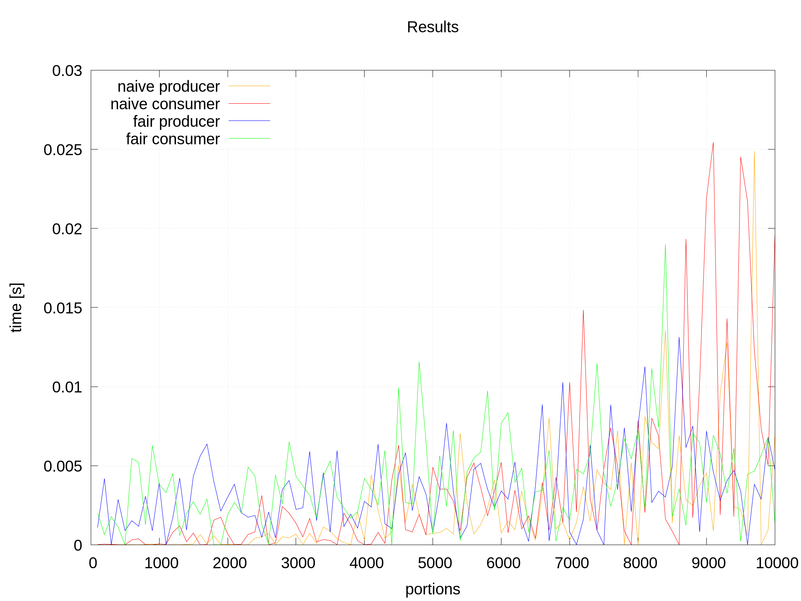
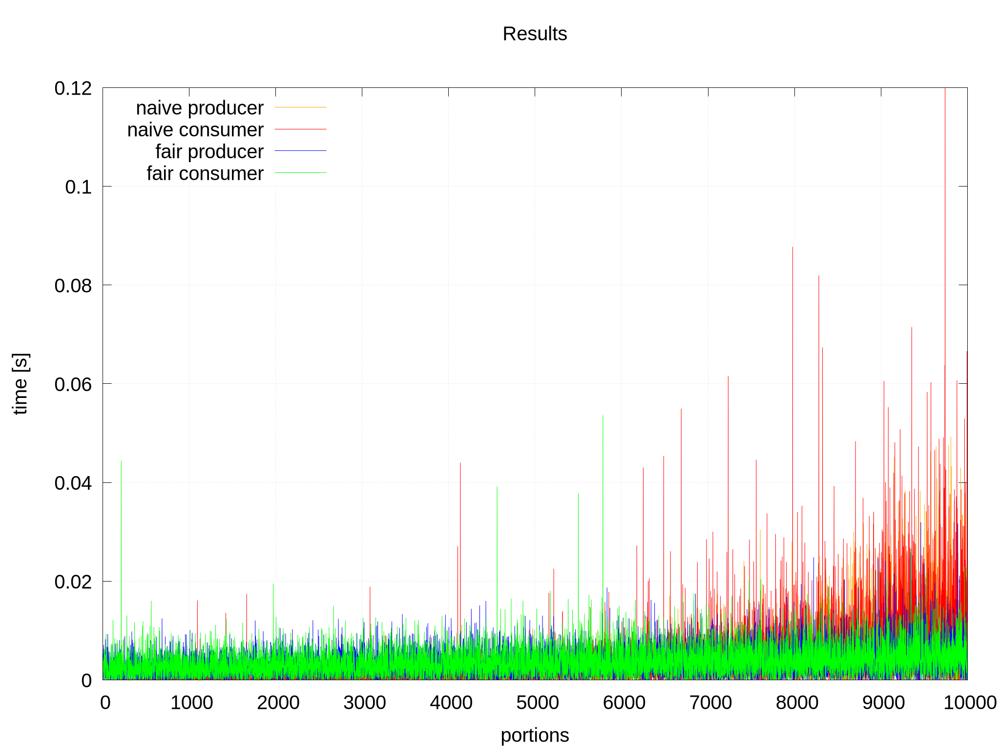
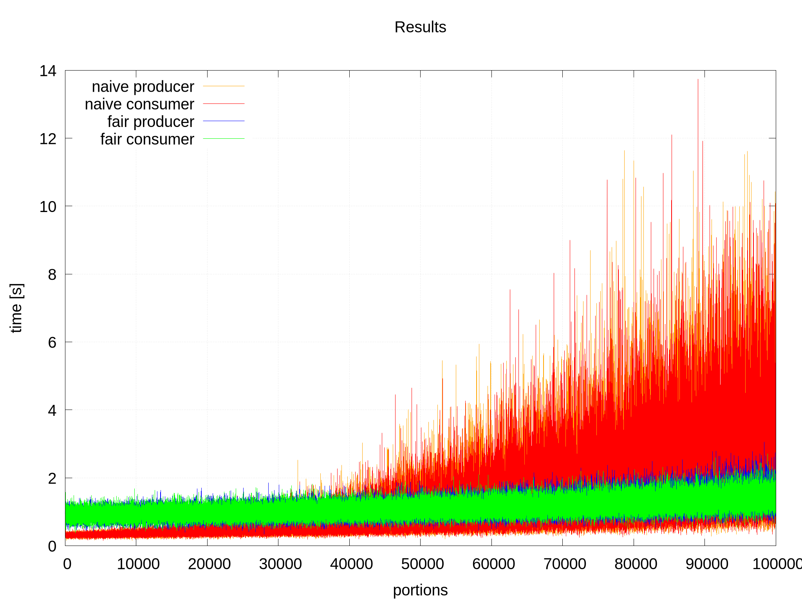
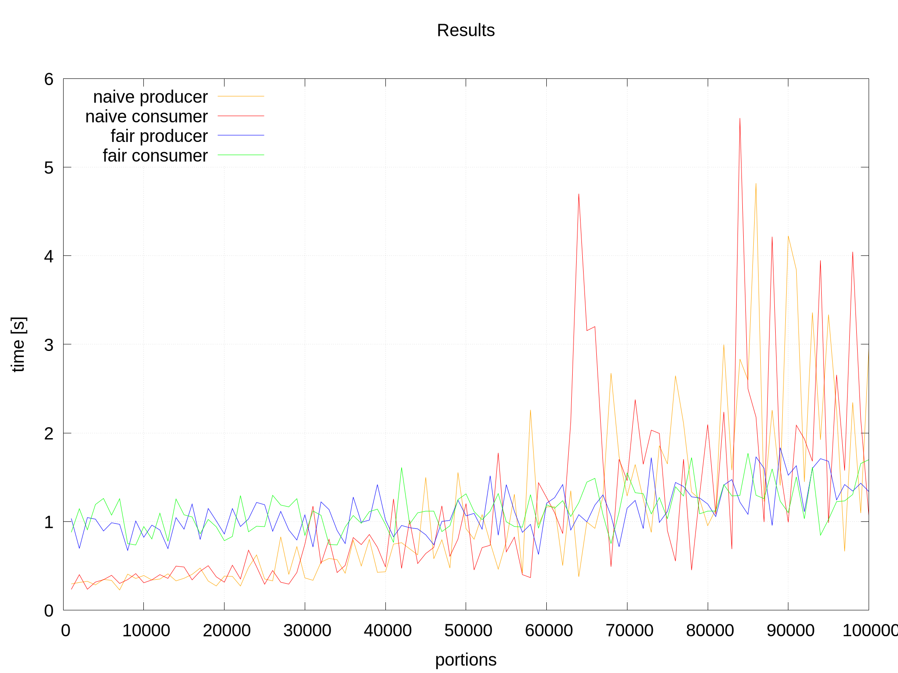

# Raport Lab03

## Zad 1

**Przetwarzanie potokowe z buforem**

* Bufor o rozmiarze N - wspólny dla wszystkich procesow!
* Proces A będacy producentem.
* Proces Z będacy konsumentem.
* Procesy B, C, ..., Y będace procesami przetwarzajacymi. Każdy proces otrzymuje daną wejściową od procesu poprzedniego, jego wyjscie zas jest konsumowane przez proces następny.
* Procesy przetwarzają dane w miejscu, po czym przechodzą do kolejnej komórki bufora i znowu przetwarzają ją w miejscu.
* Procesy dzialają z różnymi prędkościami.

Zaimplementować rozwiązanie przetwarzania potokowego (Przykładowe załozenia: bufor rozmiaru 100, 1 producent, 1 konsument, 5 uszeregowanych procesów przetwarzających.) Od czego zależy prędkość obróbki w tym systemie ? Rozwiązanie za pomocą semaforów lub monitorów (dowolnie)

### Rozwiązanie

W rozwiązaniu skorzystam z mechanizmu monitorów. \
Dla wygody rozwiązania ustalmy, że brak wiadomości to `-1` a wiadomości są odpowiednio liczbami naturalnymi `0..n-1` gdzie `n - ilość uczestników łańcucha przetwarzania`

1. producent : -1 -> 0
2. proces 1 : 0 -> 1
3. proces 2 : 1 -> 2 \
…
4. konsument : n-1 -> -1

Dodatkowo scenariusz zakłada, że mamy jednego producenta, n-2 procesorów i jednego konsumenta, jednak budowa mechanizmu monitorów i możliwośś zainicjowania producentów, procesorów i konsumentów z różnymi oczekiwanymi wiadomościami wejściowymi i wyjściowymi nie zabrania użycia dowolnej większej liczby każdego z nich. Procesory także mogą się powielać, np. używamy dwóch procesorów zmieniających wiadomość 1->2 a pięciu procesorów 4->5.

W buforze przechowuję tyle warunków `Condition` ile jest uczestników procesu produkcyjnego. Dzięki temu mogę wywołać następny proces do działania (produkcji, przetwarzania lub konsumpcji wiadomości).

**Mechanizm wywoływania następnego procesu v1**
Pierwotna wersja wywoływania następnego procesu zakładała obudzenie tylko jednego procesu - kolejnego w tablicy procesów. Niestety okazało się, że lubi się zakleszczyć.

```java
conditions[nextIdx].signal();
```

**Mechanizm wywoływania następnego procesu v2**
W kolejnej wersji użyłem bardziej inteligentnego rozwiązania - spróbuj zawołać wszystkie procesy w kolejności - następny, następny itd … jednak okazało się to dość mało sprawiedliwe bo proces większość czasu był bezczynny i czekał na swoją kolej a później miał bardzo dużo pracy.

```java
    private void signaller(int nextIdx) {
        for ( int i = 0; i < this.M; i++) {
            conditions[(i+nextIdx)%this.M].signal();
        }
    }
```

**Mechanizm wywoływania następnego procesu v3**
W ostatniej - najbardziej sprawiedliwej wersji - odwróciłem kolejność wywoływania następnych procesów do działania dzięki czemu ich wywoływanie jest bardziej równomierne.

```java
    private void signaller(int nextIdx) {
        for ( int i = this.M-1; i > -1; i--) {
            conditions[(i+nextIdx)%this.M].signal();
        }
    }
```

*Uwagi*
Każdy z procesów działa tak samo - zmienia liczbę (wiadomość) w buforze na odpowiedni numer - dlatego wewnątrz bufora publiczne metody `put`, `process` i `take` są implementowane przez prywatną metodę `stateChanger`. \
Analogiczna sytuacja jest z klasami `Producer`, `Processor` oraz `Customer` jednak tam problemem technologicznym w Java okazało się dziedziczenie więc zrezygnowałem z implementowania tego przez klasę-rodzica.

## Zad 2

**Producenci i konsumenci z losową iloscią pobieranych i wstawianych porcji** \

* Bufor moze pomiescic 2M nierozróżnialnych elementow (kolejnosc nie istotna)
* Jest wielu producentów i konsumentów
* Producent wstawia do bufora losową liczbę elementów (nie wiecej niz M)
* Konsument pobiera losową liczbę elementów (nie wiecej niz M)

Wyjasnić po co zalozenie o M.

Zaimplementować rozwiązanie z losową liczbą porcji w dwóch wariantach:

1. Wariant naiwny: producent / konsument jest wstrzymywany aż w buforze nie będzie wystarczająco dużo miejsca / elementów.
2. Wariant sprawiedliwy: zapobiega zagłodzeniu procesów produkujących lub konsumujących duże porcje. Wymyślić własne (NIE używać prorytetów!), bądź użyć rozwiązania według książki \
    > Problemy pochodzą z książki Z. Weiss, T. Gruzlewski, Programowanie wspolbiezne i rozproszone.

Proszę uruchomić obydwa warianty algorytmu dla wielu producentów i konsumentów, a następnie zmierzyć i przedstawić na wykresie porównawczym (osobno dla producentów i konsumentów) średni czas oczekiwania na dostęp do bufora w zależności od wielkości porcji (czas metod put() i get()).

Uwagi:

* Producenci i konsumenci losują wielkość porcji przed każdą operacją.
* Każda wielkość porcji jest losowana z równym prawdopodobieństwem;
* Do pomiaru czasu proszę używać System.nanoTime()
* Przykladowy zestaw testow: M rowne 1000, 10k, 100k Konfiguracji P-K: 10P+10K, 100P+100K, 1000P+1000K

### Rozwiązanie

#### Naive

Tutaj nie trzeba wiele tłumaczyć:

1. producent po prostu sprawdza czy może dodać do tablicy swoje produkty i jeśli nie to czeka

    ```java
    while (bufferSize - currentNumberOfElements < portion)
        canUseBuffer.await();
    ```

2. jeśli może to dodaje

    ```java
    for (int i = currentNumberOfElements; i < currentNumberOfElements + portion; i++)
        elements[i] = true;
    ```

3. konsument sprawdza czy porcja czekająca na buforze jest dla niego wystarczająca i jeśli nie to czeka

    ```java
    while (currentNumberOfElements < portion)
        canUseBuffer.await();
    ```

4. jeśli może to konsumuje

    ```java
    for (int i = currentNumberOfElements - 1; i >= currentNumberOfElements - portion; i--)
        elements[i] = false;
    ```

#### Fair

W rozwiązaniu sprawiedliwym wprowadzamy dodatkowe warunki oraz flagi:

```java
    private final Condition firstProducer = lock.newCondition();
    private final Condition producerRest = lock.newCondition();
    private final Condition firstConsumer = lock.newCondition();
    private final Condition consumerRest = lock.newCondition();

    private boolean isWaitingProducer;
    private boolean isWaitingConsumer;
```

Odpowiednio pierwszy w kolejce i czekający w kolejce proeucent oraz pierwszy w kolejce i czekający w kolejce konsument.

Na przykładzie producenta:

1. jeśli w kolejce jest oczekujący producent to czekamy

    ```java
    if (isWaitingProducer)
        producerRest.await();
    isWaitingProducer = true;
    ```

2. kiedy producent dostanie dostęp do bufora i zakończy operacje na buforze powiadamia czekającego producenta oraz pierwszego w kolejce konsumenta

    ```java
    isWaitingProducer = false;
    producerRest.signal();
    firstConsumer.signal();
    ```

3. reszta operacji pomiędzy działa tak samo jak w wersji `Naive`

4. konsument działa analogicznie do producenta
5. konsument działa analogicznie do producenta
6. konsument działa analogicznie do producenta

#### Problem zakończenia programu

Bardzo częstą sytuacją byłoby, że program po prostu mógłby się nie zakończyć ponieważ konsument czekałby aż producent (który już nie działa) wrzuci do buforu następne porcje. Rozwiązanie, którego użyłem to stworzenie w buforze dwóch list dla producenta i konsumenta o rozmiarach `processTimes * M` i zakresie wartości `0..M`, gdzie `processTimes` to ilość powtórzeń danej wartości w liście a następnie "potasowanie" kolejności tych liczb:

```java
    List<Integer> producersPortions = new ArrayList<>();
    List<Integer> consumersPortions = new ArrayList<>();

    public Buffer(…) {
        if (this.portionTimes > 0) {
            for (int i = 0; i < bufferSize / 2; i++) {
                for (int a = 0; a < portionTimes; a++) {
                    producersPortions.add(i);
                    consumersPortions.add(i);
                }
            }
            Collections.shuffle(producersPortions);
            Collections.shuffle(consumersPortions);
        }
    }   
```

Losowanie to po prostu pobranie i usunięcie z listy 0. elementu do momentu aż listy będą całkowicie puste:

```java
portion = producersPortions.remove(0);
```

Dlaczego to działa i jest losowe?
A no dlatego, że suma wszystkich liczb w obydwóch listach jest równa oraz liczby występują w losowej kolejności

#### Problem mierzenia czasu

Aby zapewnić pomiar czasów, przetwarzanie zmierzonych czasów, zapis wyników do pliku itd stworzyłem do tego osobną klasę `Statistics`. Zawiera ona 4 listy przechowujące podczas działania programu na kolejnych indeksach sumy poszczególnych czasów działania dla kolejnych porcji `0..M`:

```java
private double[] naiveProducerArray;
private double[] naiveCustomerArray;
private double[] fairProducerArray;
private double[] fairCustomerArray;
```

Czas mierzę za pomocą oddelegowanych metod z klasy `Statistics`:

```java
    public long getNanoStartTimestamp() {
        return System.nanoTime();
    }

    public long getNanoDuration(long startTimestamp) {
        return System.nanoTime() - startTimestamp;
    }
```

otaczając blok działania wątka swoimi metodami:

```java
        long ts = statistics.getNanoStartTimestamp();       // start
        lock.lock();
        if (this.portionTimes > 0)
            portion = consumersPortions.remove(0);
        try {
            // …

        } finally {
            lock.unlock();
            statistics.putNaiveCustomer(portion, statistics.getNanoDuration(ts));   // zapisz zmierzony czas do tablicy 
        }
```

Przchowywanie sumy na kolejnych indeksach tablicy:

```java
    public void putNaiveCustomer(int idx, long value) {
        naiveCustomerArray[idx] += (double) value;
    }
```

Aby przeliczyć sumę czasów na czas średni potrzebuję dokonać przeliczenia każdej z tablic. Robię to za pomocą metod dzielących sumę elementów z danego indeksu (czyli po prostu `arr[idx]` bo na indeksie przechowuję już sumę) tablicy przez ilość powtórzeń (`/ this.portionTimes`) każdej wielkości porcji oraz przeliczam wynik na sekundy (`/ 1000000000`):

```java
    public void avgNaiveProducer() {
        for (int i = 0; i < this.M; i++) {
            naiveProducerArray[i] = naiveProducerArray[i] / this.portionTimes / 1000000000;
        }
    }
```

Zapis danych do pliku wynikowego:

```java
    public void saveResults() throws FileNotFoundException, UnsupportedEncodingException {
        PrintWriter writer = new PrintWriter("Lab04/Results/results.dat", "UTF-8");
        writer.println("portion\tnaivProd\tnaivCons\tfairProd\tfairCons");
        for (int i = 0; i < this.M; i++) {
            writer.println(i + "\t" + naiveProducerArray[i] + "\t" + naiveCustomerArray[i] + "\t" + fairProducerArray[i] + "\t" + fairCustomerArray[i]);
        }
        writer.close();
    }
```

#### Problem generowania wykresu

Generowanie wykresów w Java to droga krzyżowa

1. Stacja 1.: NullPointerException \
… modlitwa do StackOverflow
2. IllegalStateException \
… modlitwa do StackOverflow
3. …

Z racji, że była 22:00 a ja chciałem iść spać rozsądnym rozwiązaniem było wypisanie danych w odpowiednim formacie do pliku tekstowego `results.dat`:

```txt
portion naivProd    naivCons    fairProd    fairCons
1   1   6   0   0
2   2   7   0   0
3   5   9   0   0
4   6   5   0   0
5   8   4   0   0
6   20  1   0   0
7   23  4   0   0
8   0   3   0   0
9   -1  2   0   0
```

oraz użycie prostego (i przede wszystkim działającego!) gnuplota do stworzenia wykresu:

```plt
set terminal pngcairo enhanced font "arial,30" fontscale 1.0 size 2048, 2*768
set key left top
set title "Results\n"
set xlabel "portions"
set ylabel "time [s]"
set grid
set output 'results.png'
plot "results.dat" using 1:2 every 100 title "naive producer" lt rgb "orange" with line , "results.dat" using 1:3 every 100 title "naive consumer" lt rgb "red" with line , "results.dat" using 1:4 every 100 title "fair producer" lt rgb "blue" with line , "results.dat" using 1:5 every 100 title "fair consumer" lt rgb "green" with line 
```

#### Raport

Wykresy zostały sporządzone dla danych tesgowych:

```java
var M = 10000;
var producerNumber = 100;
var customerNumber = 100;
var portionTimes = 5;
```

Wykres narysowany dla porcji co 100 jednostek (bardziej czytelny)


Wykres narysowany dla każdej porcji (mniej czytelny)


Po zdobyciu dostępu do potężniejszej maszyny niż mój laptopik poprawiłem wykres dla nowych danych

```java
var M = 100000;
var producerNumber = 1000;
var customerNumber = 1000;
var portionTimes = 30;
```

Wykres narysowany dla każdej porcji (bardziej pokazujący skalę niesprawiedliwości)


Wykres narysowany co 1000 porcji (mniej pokazujący skalę niesprawiedliwości)


Z wykresów widać, że w wariancie sprawiedliwym dla dużych wartości porcji czasy oczekiwania są znacznie mniejsze niż w wariancie naiwnym.
